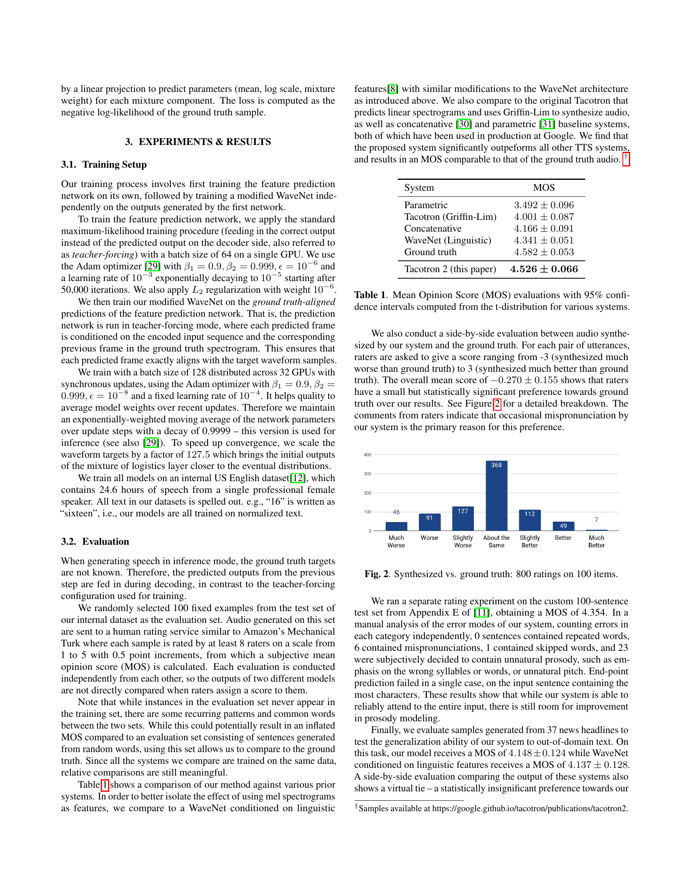

# Agentic PDF Analysis Workflow with 🦜🔗  Google's Gemma Model Smoldocling VLM Huggingface ChromaDB Streamlit

## Overview 🔍
Below are some snaps from the project:

<table>
  <tr>
    <td>
      
      <p><strong>Description 1:</strong> Optical Coherence Tomography Scan's Interpretation </p>
    </td>
    <td>
      
      <p><strong>Interface 1:</strong> Rendered Summary StreamLit App</p>
    </td>
  </tr>
  <tr>
    <td>
      
      <p><strong>Description 2:</strong> Dentistry Journal X-ray Spectroscopy Micrograph</p>
    </td>
    <td>
      
      <p><strong>Interface 2:</strong> Streamlit APP</p>
    </td>
  </tr>
</table>

This AI-powered system transforms scientific article analysis through a multi-stage pipeline that combines:
- **Layout Understanding**: Computer vision for PDF structure parsing
- **Content Intelligence**: LLM-driven semantic processing
- **Conversational Interface**: Context-aware Q&A with document memory

## Decision-Making Process 🤖
##Here’s an ASCII‐art flowchart capturing the core decision logic of The agentic RAG system
```
                           ┌───────────────┐
                           │   Start /     │
                           │  User Query   │
                           └──────┬────────┘
                                  │
                                  ▼
                     ┌─────────────────────────────┐
                     │ similarity_search_with_score│
                     │  (k=5) on Chroma DB         │
                     └──────┬──────────────────────┘
                            │
                 ┌──────────┴───────────┐
                 │                      │
                 ▼                      ▼
      ┌─────────────────────┐    ┌───────────────────┐
      │ No docs returned?   │    │ Docs + distances  │
      └──────┬──────────────┘    └──────┬────────────┘
             │                            │
       Yes   │                     Extract sims = 1 − d
             │                       max_sim = max(sims)
             │                            │
             │                            ▼
             │              ┌───────────────────────────┐
             │              │ max_sim < 0.75 ?          │
             │              └───────┬───────────────────┘
             │                      │
             │                Yes   │   No
             │                      │
             ▼                      ▼
┌───────────────────────┐   ┌──────────────────────────┐
│ FULL-DOCUMENT QA      │   │ check_local_knowledge()  │
│ (process_markdown_qa) │   │   (router LLM “Yes/No”)  │
└───────────────────────┘   └──────────┬───────────────┘
                                       │
                             ┌─────────┴────────┐
                             │                  │
                             ▼                  ▼
                ┌────────────────────┐  ┌─────────────────────┐
                │ Answer: Yes        │  │ Answer: No          │
                │ → RetrievalQA.run  │  │ → FULL-DOCUMENT QA  │
                └────────────────────┘  └─────────────────────┘
                                       
                                       
                                      [END]


```
### Adaptive Workflow Routing
1. **PDF Conversion & Layout Analysis**
   - Uses SmolDocling model to detect text regions, images, and tables
   - Makes coordinate-system decisions based on visual document structure

2. **Content Extraction**
   - Chooses between text-focused or image-focused processing:
     - Direct text extraction for paragraphs/formulas
     - Gemma3:4b-powered description for visual elements

3. **Query Resolution**
   - Routes questions through:
     - Vector search (for technical terms)
     - Full-text analysis (for broad concepts)
     - Hybrid approach (for mixed queries)

## Key Features ✨
### Interactive PDF Analysis
- **Chat Interface** 💬  
  Ask natural language questions about:
  - Technical definitions
  - Experimental results
  - Statistical analyses
  - Methodology details

- **Visual Intelligence** 🖼️  
  Automatic generation of:
  - Figure descriptions
  - Chart explanations
  - Diagram annotations

- **Structured Outputs** 📄
  - Rendered Markdown summaries with:
    - Preserved mathematical notation
    - Table formatting
    - Section hierarchy
  - One-click PDF export of summaries

- **Multi-Modal Insights** 🔄  
  Cross-references between:
  - Text content
  - Visual elements
  - Extracted metadata

- **Context-Aware Answers** 🧠  
 ### Maintains conversation history for (through langchain.memory.ConversationBufferMemory) :
  - Follow-up questions
  - Comparative analysis
  - Temporal reasoning

## Technical Highlights ⚙️
- **Confidence-Based Routing**  
  Automatically selects the processing path based on:
  - Semantic similarity scores
  - Content type detection
  - Query complexity analysis

- **Fallback Mechanisms**  
  Safely handles edge cases through:
  - Full-text fallback for low-confidence extracts
  - Hybrid answer generation
  - Error containment subsystems


A multi-stage PDF processing system that combines computer vision, LLM-based content extraction, and conversational AI for interactive document analysis.

## Features

- **PDF to Structured Markdown Conversion**
  - Page segmentation with layout analysis
  - Image region detection and cropping
  - Caption-aware content structuring
- **AI-Powered Analysis**
  - Section-wise summarization with academic focus
  - Technical detail preservation (equations, tables, medical terms)
  - Conversational Q&A with context-aware retrieval
- **Multi-Interface Support**
  - Streamlit web interface with visual previews
  - Jupyter notebook integration
  - Command-line interface (CLI)

## Installation

### Prerequisites
- Python 3.9+
- Ollama (latest version)
- CUDA-enabled GPU (recommended)
- wkhtmltopdf (for PDF export)

### Setup

2. ## Create A Virtual Environment(Optional): ##
```bash
python -m venv venv
```

1. Install Ollama and the required models:

```bash
curl -fsSL https://ollama.com/install.sh | sh
ollama pull gemma3:4b
 ```
### Install Poppler
```bash
sudo apt-get install poppler-utils
```

Clone the repository and install dependencies:
```bash
git clone https://github.com/KaustubhK94/Agentic-PDF-Analysis-Workflow-with-Gemma-Huggingface-ChromaDB-Streamlit.git
cd my_streamlit_app
pip install -r requirements.txt
 ```

Streamlit Interface
```bash
streamlit run my_streamlit_app/app_new.py
 ```

# Command Line Interface
## Process PDF and start interactive session
```bash
python my_streamlit_app/agentic_rag_app.py --pdf path/to/document.pdf
```

## Generate summary only
```bash
python my_streamlit_app/agentic_workflow.py --pdf input.pdf --output_path summary.md
```

# Jupyter Integration
```
from agentic_workflow import main_jupyter
main_jupyter(pdf_path="your_document.pdf")
```

## Project Structure

```
my_streamlit_app/
├── agentic_workflow.py       # Core PDF processing pipeline
├── agentic_rag_app.py        # RAG system implementation
├── app_new.py                # Streamlit interface
├── utils.py                  # Helper functions
├── config.py                 # Path configurations
├── media/                    # Generated content storage
│   ├── uploads/              # User-uploaded PDFs
│   ├── pdf_images/           # Converted page images, their respective extracted markdowns, and doctag files 
│   ├── crops/                # Extracted image regions and their descriptions in JSON file
│   └── chroma_db/            # Vector database storage
└── requirements.txt          # Python dependencies
```


## Models Used

### Core Processing Pipeline
| Model Name | Purpose | Source | Installation |
|------------|---------|--------|--------------|
| [ds4sd/SmolDocling-256M-preview](https://huggingface.co/ds4sd/SmolDocling-256M-preview) | Document layout analysis & structure extraction | Hugging Face | Auto-downloaded via vLLM |
| [gemma3:4b](https://ollama.com/library/gemma3:4b) | Image description & text summarization | Ollama | `ollama pull gemma3:4b` |

### Additional Components
| Model Name | Purpose | Source | Installation |
|------------|---------|--------|--------------|
| [sentence-transformers/all-mpnet-base-v2](https://huggingface.co/sentence-transformers/all-mpnet-base-v2) | Text embeddings for RAG | Hugging Face | Auto-installed via `langchain` |

**Requirements:**
1. Ollama server must be running (`ollama serve`)
2. GPU recommended for optimal performance
3. Minimum VRAM requirements:
   - 8GB for SmolDocling
   - 16GB for Gemma3:4b

**Usage Notes:**
- SmolDocling handles PDF layout understanding and coordinate extraction
- Gemma3:4b provides multimodal capabilities for image understanding and text processing
- MPNet embeddings enable semantic search in document Q&A

## Key configurations:

```
PDF_PATH = "1712.05884v2.pdf"              # Default input PDF
COMBINED_MD = "media/combined_extraction.md"  # Processed output
CHROMA_DB_DIR = "media/chroma_db"           # Vector storage
```

## Note: Ensure Ollama server is running (ollama serve) before starting the application.


Key points to emphasize:
1. Requires Ollama running locally
2. GPU acceleration recommended
3. The file structure is automatically created on first run
4. Supports both academic and medical articles.
5. Preserves technical details through the processing pipeline

# PDF vs. Markdown Side-by-Side


<!-- README.md -->

## PDF vs. Extracted Markdown

<table>
<tr>
  <!-- PDF page screenshot -->
  <td align="center" valign="top">
    
    <p><em>Figure A: PDF page</em></p>
  </td>

  <!-- Markdown-rendered screenshot -->
  <td align="center" valign="top">
    
    <p><em>Figure B: Extracted Markdown</em></p>
  </td>
</tr>
</table>


